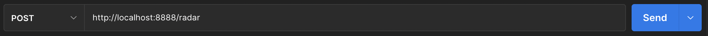
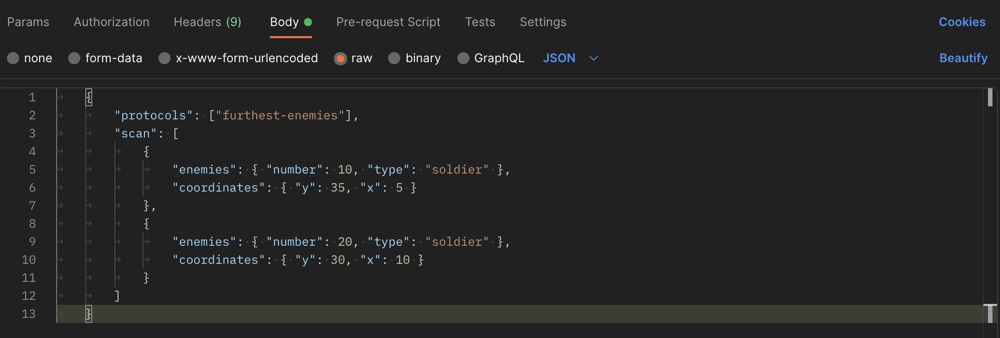
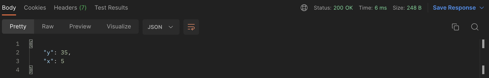

# Aratech Backend Project

## Descripción del proyecto

La idea del proyecto es terminar el nuevo droide de combate R0-GR al que aún le falta el módulo de selección de objetivos a atacar.

Las instrucciones que debe leer el droide es la siguiente información:

- **protocols** : Protocolo o lista de protocolos que han de ser usados para determinar cual de los siguientes puntos debe de atacarse primero.
- **scan** : Lista de puntos extraidos del módulo de visión, que es un listado de puntos con el número de objetivos de esa posición, y los siguientes subvalores:
  - **coordinates** : Coordenadas x e y del punto.
  - **enemies** : Tipo de enemigo type y número number . Los posibles valores de type serán: soldier y mech.
  - (opcional) **allies** : Número de aliados que hay en dicha posición. Si no está presente este valor, significa que no hay aliados en la zona.

La respuesta que obtendrá el droide cuando le demos la información seran las coordenadas donde atacar.

**Protocolos disponibles**:

- **closest-enemies** : Se deberá priorizar el punto más cercano en el que haya enemigos.
- **furthest-enemies** : Se deberá priorizar el punto más lejano en el que haya enemigos.
- **assist-allies** : Deberan de priorizarse los puntos en los que exista algún aliado.
- **avoid-crossfire** : No debe de atacarse ningún punto en el que haya algún aliado.
- **prioritize-mech** : Debe de atacarse unm ech si se encuentra. En caso negativo, cualquier otro tipo deobjetivo será válido.
- **avoid-mech** : No debe de atacarse ningún enemigo del tipo mech

Podremos enviar un protocolo o más de uno en función de nuestro objetivo. Hay que tener en cuenta, también, que los objetivos a una distancia superior a 100 m seran ignorados.

## Instalación

Para ver y probar el resultado del código implementado se pueden seguir los siguientes pasos:

1- Haz un fork del repositorio y clónalo en tu máquina:

```bash
https://github.com/xfortunyi/aratech-backend-project.git
```

2- Ejecuta npm install en la carpeta server para instalar las dependencias del proyecto.

```bash
cd server
npm install
```

3- Abrimos el servidor.

```bash
nodemon index.js
```

## Ejecución

Una vez tengamos instalado las dependencias del proyecto en nuestra máquina local, podemos testear nuestro droide con el módulo de "ataque" implementado.

Para ello, utilizaremos Postman. Postman es una plataforma de API para que los desarrolladores diseñen, construyan, prueben e iteren sus API. En nuestro caso lo probaremos de la siguiente manera:

1- Tal y como muestra la imagen, lo primero que haremos es marcar la opción POST, seguido de la url donde se aloja el proyecto, con su respectivo puerto (8888) y endpoint (/radar). En este caso será: http://localhost:8888/radar.

<div align=center>

</div>

2- Seguidamente, marcaremos la opción Body, donde pondremos las instrucciones (raw) que recibirá nuestro droide en formato JSON.

<div align=center>

</div>

3- Cuando tengamos el body escrito, clicaremos SEND (ver imagen 1) y obtendremos las coordenadas donde nuestro droide atacará siguiendo las condiciones de los protocolos aportados.

<div align=center>

</div>

## Testing

A continuación mostramos dos formas de corraborar que l'aplicación funciona a través de distintos métodos de test.

1- Accedemos a la carpeta Test y ahí vamos a la carpeta Test_cases para correr el archivo tests.sh que encontramos:

```bash
cd server
cd test
cd test_cases
./tests.sh
```

En nuestra terminal veremos como se ejecutan 13 tests, que son los casos presentados en el archivo test_cases.txt

2- Se ha elaborado un módulo de testeo personalizado para comprobar la ruta y las funciones que se ejecutan en el proyecto. Para correr este testeo simplemente escribe en la terminal:

```bash
cd server
npm test
```

## Tecnología utilizada

**Servidor**

<p align="left">
<a href="https://nodejs.org/en/" target="_blank" rel="noreferrer"></a>
<a href="https://expressjs.com/" target="_blank" rel="noreferrer"></a>

**Test**


## Autor

Xavier Fortuny - [Github](https://github.com/xfortunyi) - [Linkedin](https://www.linkedin.com/in/xavifortuny/)
